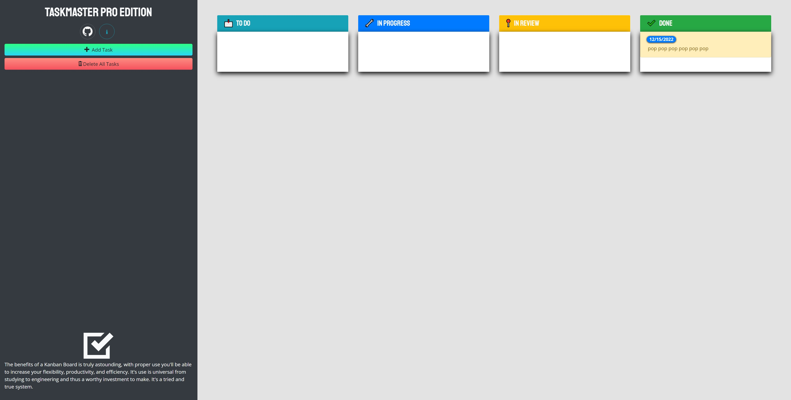
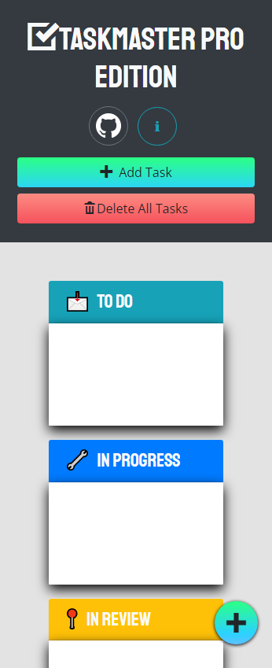

# 📅 Taskmaster Pro 📅

:computer: **Live Deployment:** https://jwilferd10.github.io/taskmaster-pro/

:computer: **Github Repository:** https://github.com/jwilferd10/taskmaster-pro

## :open_file_folder: Table of Contents:
  - [Preview](#camera-preview)
  - [Demo](#movie_camera-demo)
  - [Description](#wave-description)
  - [User Story](#book-user-story)
  - [Resources Used](#floppy_disk-resources-used)
  - [Installation](#minidisc-installation-and-usage)
  - [Contact Information](#e-mail-contact-information)

## :camera: Preview:

  
  

## :movie_camera: Demo:

## :wave: Description: 

 
Taskmaster Pro is a kanban board application that allows users to create tasks and systematically track the process from start to finish. To create a new task users must provide a description and due date, once the task is saved it'll create an HTML object that can be clicked and dragged between each stage of development. If users wish they can terminate ALL tasks by clicking the 'Delete All Tasks' button, to remove a single task the user can select and drag the task to where it says 'Drop Here To Remove'. Each task created is saved to localStorage.

Taskmaster Pro was brought to life by the use of jQuery for it's quick and easy setup, Bootstrap for it's pre-established and responsive design, and Moment for setting up the task due-date and color coding each task based on due date. 

This application was the first time I used jQuery and was a part of my course at the UCLA Coding Bootcamp. However feeling the need to go further and proudly call this app my own, I have extended and improve upon this app by fixing bugs and adding features that weren't apart of the base project.

The base bootcamp project ended at commit 4e14bd4e5c3b758e0cecc1ca399aba6d81464c3b. Anything after are ammendments that I personally made. Big thanks to the UCLA Coding Bootcamp, thank YOU for checking Taskmaster Pro out - I hope you enjoy it and happy coding! 

  
## :book: User Story:
**AS A team looking to streamline production**
- I WANT an application to track my projects progress
- SO THAT I can work in a more streamlined and organized environment

**GIVEN I need a Kanban Board**
- WHEN I open the app
	- THEN I am presented with sections labelled To Do, In Progress, In Review, and Done
- WHEN I click Add Task
	- THEN I am presented a modal to enter task description and due date
- WHEN I have saved a task
	- THEN a task object appears in the app
- WHEN my project progresses 
	- THEN I can drag the task to the next section
- WHEN the tasks due date is today
	- THEN the task object is highlighted red
- WHEN the task is due soon 
	- THEN the task object is highlighted yellow
- WHEN the task is no longer needed
	- THEN I can delete the single task
- WHEN the entire project is complete
	- THEN I can delete all tasks.

## :floppy_disk: Resources Used:
Main Resources:
- HTML
- CSS
- Bootstrap 4
- JavaScript
- jQuery
- Moment

## :minidisc: Installation and Usage:
### Install:
- You can do this by clicking the *GREEN* button above and you can download it by ZIP or copy the SSH!
### Usage:
- Click the 🟢 button labelled 'ADD TASK' it'll reveal a modal
- Add a description to the task
- Add a due date to the task
- Save Task
- Task Object should appear on TO DO list
- Click/Tap the task object and drag it to desired section
- To delete a singular task drag the specific task object to the 🔴 colored area labelled "DROP HERE TO REMOVE""
- Click the 🔴 button labelled 'DELETE ALL TASKS' to delete all tasks

## :e-mail: Contact Information:
- ### [jwilferd10](https://github.com/jwilferd10)
